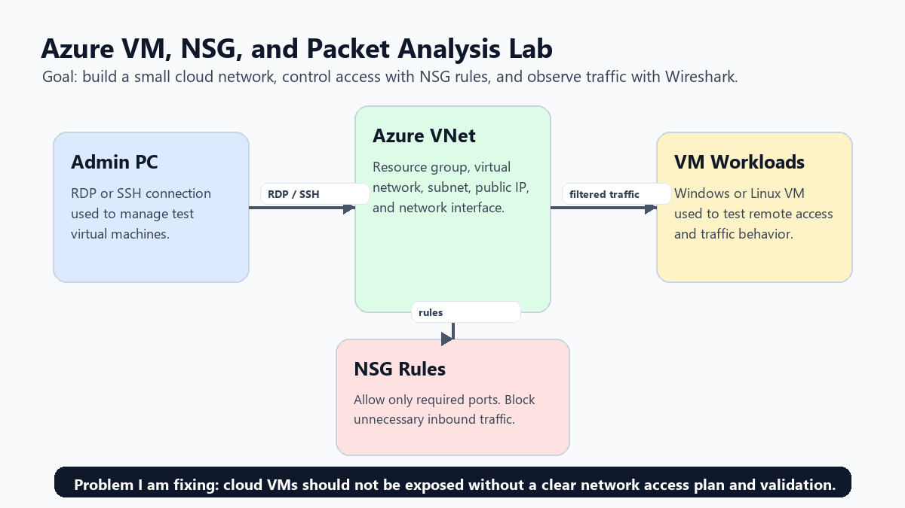

# Microsoft Azure VM, NSG, and Packet Analysis Lab

I built this lab to practice the basics of running a virtual machine in Azure and controlling how traffic reaches it. The main focus was not just "create a VM," but understanding what sits around it: the resource group, virtual network, subnet, public IP, network interface, and Network Security Group rules.

## My Goal

My goal was to deploy a cloud virtual machine, control remote access with NSG rules, and use packet analysis to understand what traffic looks like when a machine is reachable over the network.

The specific things I wanted to practice were:

- Creating an Azure resource group
- Deploying a Windows or Linux virtual machine
- Understanding the virtual network and subnet created with the VM
- Configuring Network Security Group rules for RDP or SSH
- Testing remote access
- Using Wireshark to observe traffic behavior

## The Problem I Was Fixing

Cloud VMs are easy to create, but they can also be easy to expose by mistake. If RDP or SSH is left open to the internet without a plan, the VM becomes a bigger risk than it needs to be.

This project helped me practice a safer way to think about access:

1. Know what service needs to be reachable.
2. Allow only the port needed for the lab.
3. Keep the rule scoped as tightly as possible.
4. Test the connection.
5. Review the traffic and confirm the rule is doing what I expected.

## Skills I Practiced

- Azure virtual machine deployment
- Resource group organization
- Virtual network and subnet basics
- Network Security Group rule planning
- RDP and SSH access concepts
- Packet capture with Wireshark
- Basic cloud troubleshooting and documentation

## What I Built

| Component | What it was used for |
| --- | --- |
| Resource group | Kept the lab resources organized in one place |
| Virtual machine | Test machine for remote access and traffic review |
| Virtual network | Provided the private network space for the VM |
| Subnet | Placed the VM inside a defined network segment |
| Public IP | Allowed temporary remote access for the lab |
| Network Security Group | Controlled inbound traffic to the VM |
| Wireshark | Used to view and filter traffic during testing |

## Lab Walkthrough With Screenshots

### Creating the Virtual Machine

The first step was building the VM and choosing the basic settings for the lab.

### Creating the Resource Group

I used a resource group so the VM, network, public IP, and related resources were grouped together and easier to clean up after the lab.

### Reviewing the NSG

The Network Security Group is the part of the lab that controls what inbound traffic is allowed to reach the VM.

## NSG Rule Plan

For a lab, the rule plan is simple, but the thinking matters. I only want to allow the access needed for testing.

| Scenario | Port | Protocol | Notes |
| --- | --- | --- | --- |
| Windows remote access | `3389` | TCP | RDP should be restricted to my current public IP when possible |
| Linux remote access | `22` | TCP | SSH should be restricted to my current public IP when possible |
| ICMP testing | N/A | ICMP | Useful for testing, but not always required |
| Everything else | Any | Any | Should stay denied unless there is a specific reason |

## Validation Checklist

- VM was created inside the correct resource group.
- VM was attached to the expected virtual network and subnet.
- Public IP was assigned only for remote access testing.
- NSG rule allowed the required management port.
- Unneeded inbound access was not intentionally opened.
- Remote access was tested.
- Wireshark was used to observe traffic during testing.

## Supporting Notes

I split the detailed notes into smaller documents so the README stays readable:

| Document | Purpose |
| --- | --- |
| [Network design notes](docs/network-design.md) | How the Azure resources fit together |
| [NSG rule notes](docs/nsg-rule-plan.md) | How I thought about inbound access rules |
| [Packet analysis notes](docs/packet-analysis-notes.md) | Basic Wireshark filters and what I was looking for |
| [Validation checklist](docs/validation-checklist.md) | Checks I would run before calling the lab complete |
| [Troubleshooting notes](docs/troubleshooting-notes.md) | Common issues and where I would look first |

## What I Learned

The biggest takeaway is that Azure networking is more than just giving a VM a public IP. The VM depends on several connected resources, and the NSG is one of the most important places to understand before exposing anything to the internet.

I also got more comfortable thinking through traffic flow: where the connection starts, which rule allows it, where it lands, and how to confirm it with testing.

## What I Would Improve Next

- Restrict management access to a known source IP instead of using broad inbound rules.
- Use Azure Bastion instead of exposing RDP or SSH directly.
- Add Azure Network Watcher flow logs for better traffic visibility.
- Add a second VM to test private subnet-to-subnet communication.
- Document cleanup steps so unused public IPs and disks do not stay behind.
